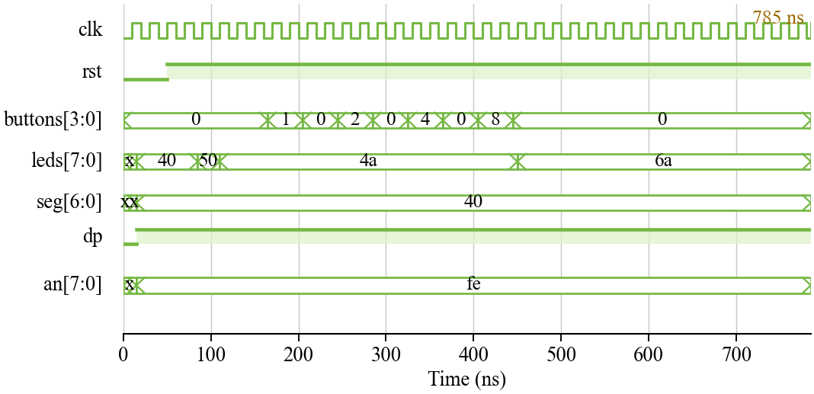
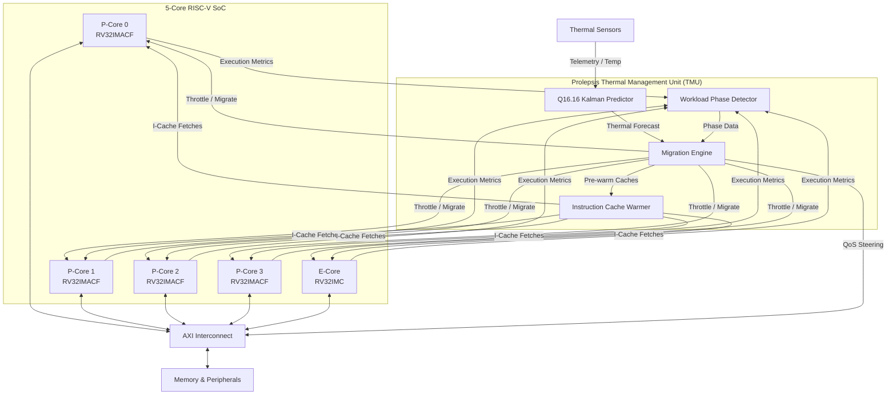
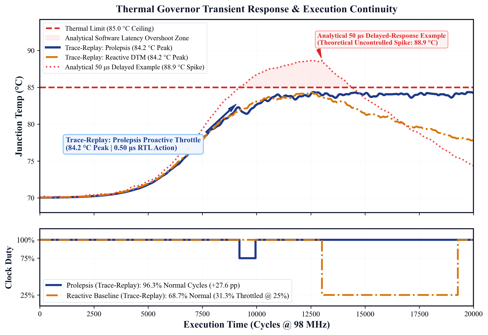
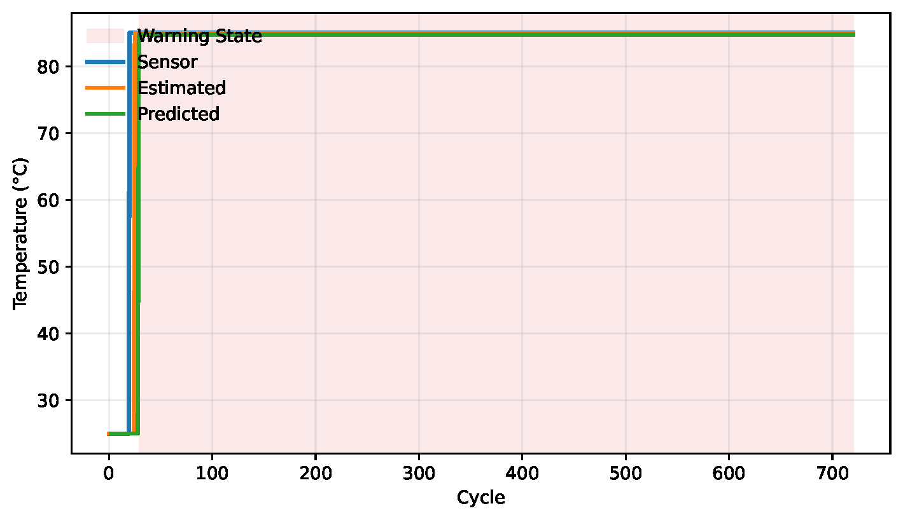

# 🌡️ Prolepsis TMU: Predictive Thermal Management


[-purple)](./Prolepsis_Explanation.pdf)

> 📘 **Comprehensive System Architecture & Technical Reference Manual:**  
> For an exhaustive, textbook-grade technical explanation of the complete Prolepsis architecture, fixed-point Kalman prediction mathematics, microarchitectural pipeline stages, cache coherence, AXI4-Lite QoS interconnect, and FPGA verification, read the [**Prolepsis Technical Architecture Reference Manual (PDF)**](./Prolepsis_Explanation.pdf).

## 📌 Overview

This repository contains a synthesis-ready SystemVerilog implementation of **Prolepsis**, an ISA-agnostic, inline RTL thermal management unit (TMU) designed for modern multicore processors.

Operating inline within the core clock domain, Prolepsis evaluates execution telemetry every 4096 cycles. It leverages a fixed-point Kalman predictor for early thermal trend forecasting to mitigate transient thermal spikes without requiring ISA extensions.

<p align="center">
  
</p>

---

## 📐 Architecture Diagram



---

## 📊 Hardware Utilization & Metrics

Synthesized and instantiated on an **AMD Xilinx UltraScale+ XCU250 FPGA**, integrated with a 5-core RISC-V SoC (four RV32IMACF P-cores and one E-core). 

The results demonstrate a highly accurate thermal prediction mechanism with a remarkably lightweight hardware footprint, meeting timing at 98 MHz.

<p align="center">
  
</p>

| Metric | Reactive Baseline | Prolepsis (Proposed) | Change / Notes |
| :--- | :---: | :---: | :---: |
| **Prediction RMSE** | N/A | **0.087 °C** | Q16.16 Kalman |
| **Prediction MAE** | N/A | **0.059 °C** | Q16.16 Kalman |
| **Normal-Speed Execution** | 68.7% | **96.3%** | Under 85.0 °C Limit |
| **Max Frequency (Fmax)** | N/A | **101.16 MHz** | Meets timing at 98 MHz |
| **Resource Utilization** | N/A | **18,015 LUTs** | 1.04% of total FPGA / 12.55% of SoC |

*Note: In trace-replay evaluations, Prolepsis significantly outperforms reactive baselines by accurately forecasting thermal trends and preemptively migrating or throttling tasks before a critical thermal limit is breached.*

---

## ✨ Key Features

### ✔ Predictive Forecasting
* **Q16.16 Kalman Predictor:** Hardware-implemented fixed-point Kalman filter forecasts impending thermal violations by analyzing past and present thermal states along with core execution telemetry.
* **Workload Phase Detector:** Analyzes microarchitectural execution metrics at runtime to classify phases and inform migration decisions.

<p align="center">
  
</p>

### ✔ Mitigation Strategies
* **Dynamic Task Migration:** Seamlessly offloads threads from P-cores to E-cores before thermal emergencies occur.
* **Instruction Cache Warming:** Pre-warms the target core's instruction cache before migration to minimize context-switch latency.
* **QoS Steering & Duty Throttling:** Adjusts interconnect priority and pipeline duty cycles for immediate, short-term thermal relief.

---

## 🚀 Verification & Results

The complete thermal-control stack has been rigorously tested using extensive trace-replay methodologies and hardware simulations.

**Simulation Environments:**
* **`sim_kalman_tb` / `tb_kalman_filter.sv`:** Validates the fixed-point Kalman matrix computations against floating-point ground truths.
* **`sim_migration` / `tb_migration_controller.sv`:** Validates the firmware-assisted task migration state machines and core handover.
* **`sim_eval_tb`:** Validates the entire TMU and 5-core SoC integration with closed-loop thermal emulation.

> **How to Run Simulation:** Navigate to the `sim_envs/` directory and execute the respective Python or Bash orchestration scripts for the module you wish to test. 

---

## 📂 Directory Structure
```text
Prolepsis-soc/
├── constraints/
│   ├── nexys4ddr.xdc
│   └── xcu250.xdc
├── Documentation/
│   └── Reference/              # Technical architecture specification
├── Images/
├── rtl/
│   ├── interfaces/             # AXI4-Lite and telemetry interfaces
│   ├── pkg/                    # Shared AXI/address and thermal types
│   ├── accelerator/
│   ├── bus/
│   ├── cache/
│   ├── core/
│   ├── peripherals/
│   └── thermal/
├── scripts/                    # Vivado project generation and analysis scripts
├── sw/
│   └── boot.S
├── tb/
├── .gitignore
├── files.f
├── LICENSE
└── README.md
```

## Build and timing flow

The primary RTL and testbenches use IEEE 1800 SystemVerilog (`.sv`). Packages
and interfaces are listed first in [`files.f`](files.f), followed by the SoC
sources. With Vivado installed, create the XCU250 project from the repository
root with:

```text
vivado -mode batch -source scripts/create_xcu250_project.tcl
```

The project top is `orionrv`; the timing clock and implementation guidance are
in [`constraints/xcu250.xdc`](constraints/xcu250.xdc). The detailed architectural
and microarchitectural specification is in
[`Documentation/Reference/Prolepsis_Specification.md`](Documentation/Reference/Prolepsis_Specification.md).

---

## 📄 Paper

**[Paper Coming Soon]** — I will update this section with the link to the published paper once it is available.

---

## ⚖️ License & Commercial Rights

This project is licensed under the **Prolepsis Source-Available Non-Commercial Hardware License (v1.0)**.

* **Academic & Research Use:** Free to inspect, simulate, benchmark, modify, and cite for non-commercial educational and research purposes.
* **Commercial Restrictions:** Commercial use—including ASIC tape-outs, physical silicon fabrication, commercial FPGA bitstream deployment, or proprietary SoC integration—is strictly prohibited without prior written permission and an executed commercial license.

📧 **Commercial Inquiries:** For commercial licensing terms, silicon rights, or corporate partnerships, please contact the repository owner.

